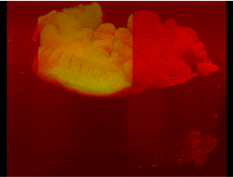

# Part of the progress

### The ImageProcessing.py  can be used to extract focused region from light-sheet fluorescence microscopy(LSFM) images, remove background for OCT images, and register the high-resolution LSFM images with the wide-field OCT images.

#### The raw LSFM image and the extracted focused region.

#### The raw OCT images and the background removed OCT image.

#### The registration result from the raw LSFM images and the raw OCT images.

raw .avi file: 

#### The registration result from the refocused LSFM images and the raw OCT images.

raw .avi file: 

#### The registration result from the refocused LSFM images and the denoised OCT images.

raw .avi file: 
